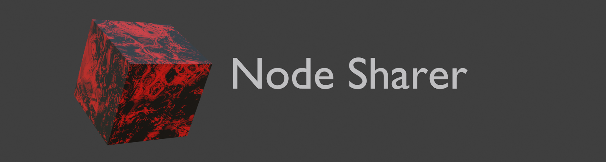
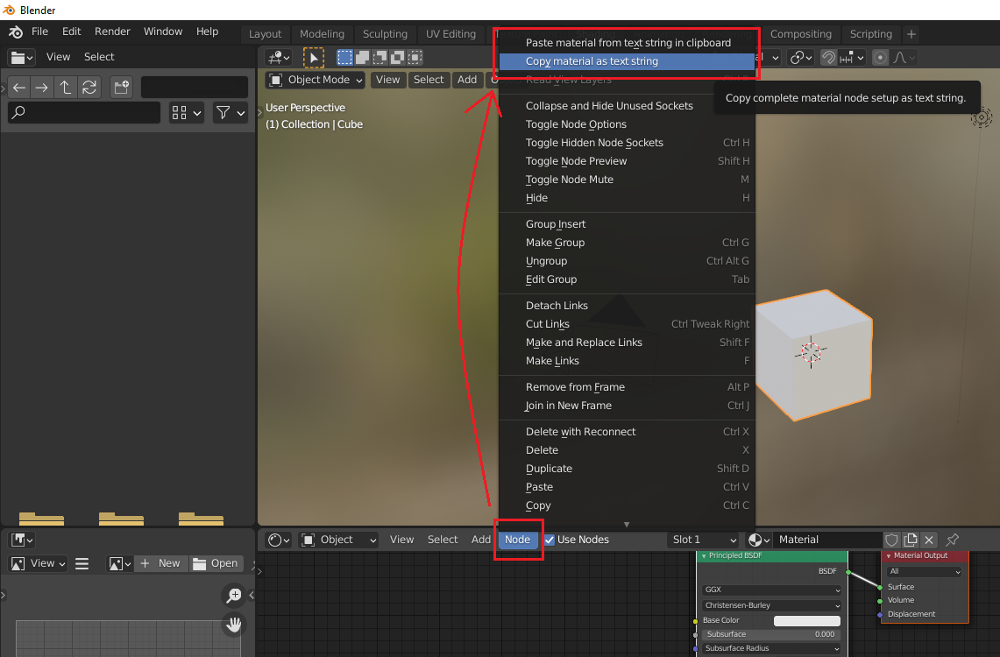

# Node sharer (Beta)

Easily share procedural materials and shader node setups as text!




## Installation
1. Download the zip-file from the green "Code" button near the top of the page or by clicking [here](https://github.com/wildiness/NodeSharer/archive/master.zip).
2. In Blender, go to Edit > Preferences > Add-ons
3. Choose "Install..." and select the just downloaded zip-file.
4. Node sharer should appear in the list. Check the checkbox to activate it.
5. Copy the text string below then, in Blender, go to the shading tab, in the shader editor press "Node" then scroll to the top of the list and select Paste material!

NS0B2900!eNqtVk1vozAQ/SuVz06EDeSDW7NNo0hJdtVuV12tKuQEJ7FEIAKT7ariv3dsTEnBaffQAwLPjMdv3jwGXlDCDhwFSPJcUoSR/HdUywOTPBMsBkuSRjxHwQtaGtvV90IeC6lM6zgUkclwv2cRz1YQXfmXTQqRwFrnoCj44/QdbK6nEpx5yDZSnHiYmrwyKzhGcbqBYNd3ses4T7gG2kYBkFm247ANXS8WCBL+SrM0ScXVT/4si4z3Hce/jBWCTDxkikQuWbJREdOHb4v5zfR6BeYtZyoRWG/pu2qcVjUYERSoharTV3cXBUTdPWX3MfL1uqyr6w2JgwkhTXk28BhVzNRnQiuKfJexEz8LG6KAlqUODaOTidRYyHuUBintYHdNvMaqMJ4qLGEkDjzJRZoAAOTeKI5nGYsET+QZAPIhyfUGKGZnHkOjtcV8Nb2++5DYhrAxGeEe8fyGMSuUd5RpZFZV+B3GLExVPVWRFtoHH1Zdb/h/1Xj9oe6E36e6E25/rFVDlX9g4oYtFRF4Q3DPJR7kOpgjO107cxnibydL1LxXttq6yrPSSPEFRXo2RWomxfNl4sB5N5vA4euYJ1GNdjl/bNOoX6m2vMmbvEllgUJGb56GNJdQTB33bLIApm7BPzKRbMQx5tHV5P7mFg79XDMQUOQ8ZPFxz1CwZXHOK8smZoejsZSXSPtSPdVTaNQnWk9aR5/pyXMp7g1GX6umoW2OKRk4VpFglO/Tv6Gs9lcfBTB22nGJrUkebZtgM9wzsS4kFKHGxuzRwqISSnWRNpNGThQuUk1LS7xn4n0jzjOG9Xpk1uN6Nr8NaVLLmdaWah678OSp/njK6dfOOjEZWuVPRubDQ8YdddCuYCi5NHAHrc9vm39LT9u/Cbq/ebHOi2zLNjw8cLlPI8g1ebhbTH+jsixfAao5cd4=

## Using Node Sharer
Node sharer has two commands. 
* Copy material as text string
* Paste material from text string in clipboard

These commands are found under the "Node" button in the Shader editor. In the standard "Shading" tab
you will have to scroll to the top of the list.

#### Copy material
This command saves the currently active material in the Shader editor 
to the clipboard as a Node Sharer text string. Take note of the length
of this text string in the Blender info pop-up.

#### Paste material
Save your file before pasting! This command creates a new material from the Node Sharer text string saved in
the clipboard. Take note of the material name in the Blender info pop-up.
The material can then be selected in the Shader editor material selector.



##### The text strings
The first 8-10 characters in an Node Sharer text string always follow the following format:
NS(version number)B(Blender version number) ! Base64 text string.
Example:
```NS0B2900!Base64...```

Node sharer text strings are JSON representations of materials, compressed with zlib
and then converted to base64. This way of sharing data is taken directly from the game Factorio. 
In which you can share blueprints of machines and assembly lines as text strings. 

### Support/help and bug reports
Creat a ticket here on Github or contact me on discord: wildiness hashtag 7533. But please check the list below first, 
It might be a known issue.

### Limitations and know bugs
* This is a Beta release, be careful and save your project before using the Node Sharer commands

* The following nodes are not supported at the moment:
    - RGB Curves (To be added)
    - Vector Curves (TBA)
    - Point density 
    - Texture coordinate with an object selected/chosen (TBA)
    - Script
    - UV map
    - Frame

* Pasting materials, materials with groups and especially nested groups can cause a crash to desktop. 
Avoid coping materials with groups for now. And only paste materials in a **SAVED** blend file.

* Nodes that use a file browser or object/UV map/Vertex group selector will not have the file path/object sent with Node Sharer, 
and so the pasted nodes will not have the correct files/object selected.

* The Node Sharer commands will appear in all node editors, including those from
other add-ons. However, the command will most likely not work with these custom nodes.

* If you use Blender in a language other than english and/or name nodes with non standard characters,
 that could cause problems, maybe.

### Contributing
Share it with your friends! The usability of this add-on increases exponentially with the amount of users.

Pull request will be accepted(if I can figure out how to do it), but no PEP8ifying.
Create an issue first, to go along side the PR.

My goal with this add-on is to show the Blender Devs that easy sharing of nodes is something Blender needs to have built in.
And I hope something similar to this will be implemented in Blender so I don't have to maintain this.
